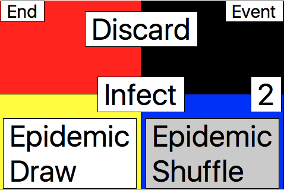

# pidemic
Replace the infection deck in Pandemic with a raspberry pi + lcd.

### Requirements
Raspberry pi with touch screen lcd installed and set up.

### Instructions
To create a desktop shortcut, copy the file pidemic.sh to your desktop (It's located in the rrsources folder).  You may need to edit this file to ensure it contains the correct path.

Run Pidemic application with command `python pidemic/` from project root. (or click on desktop shortcut once it's been created)

Run tests with command `python tests/file_name.py` from project root.

### Screenshots

